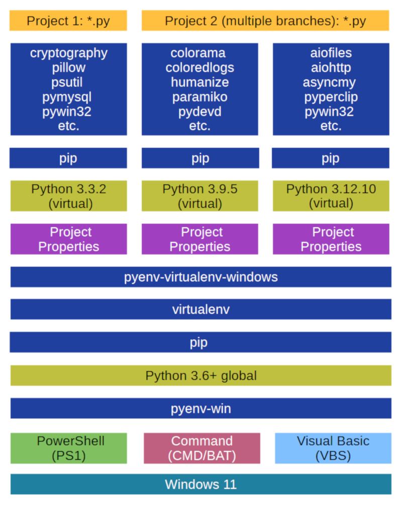

# Table of Contents 
1. [Introduction](#introduction) 
    1.1. [Architecture](#architecture) 
    1.2. [Quick Reference](#quick_reference) 
	1.3. [Description](#description)
2. [Check Dependencies](#check_dependencies) 
3. [Installation](#installation) 
4. [Path Conflicts](#path_conficts) 
5. [Location](#location) 
6. [Usage](#usage) 
    6.1. [Concepts](#concepts) 
    &nbsp;&nbsp;&nbsp;&nbsp;6.1.1. [Audits](#audits) 
    &nbsp;&nbsp;&nbsp;&nbsp;6.1.2. [Commands](#commands) 
    &nbsp;&nbsp;&nbsp;&nbsp;6.1.3. [Project Properties](#project_properties) 
    &nbsp;&nbsp;&nbsp;&nbsp;6.1.4. [Help](#help) 
    &nbsp;&nbsp;&nbsp;&nbsp;6.1.5. [Logging](#logging) 
	6.2. [Create Virtual Environment](#create_virtual_environment) 
	&nbsp;&nbsp;&nbsp;&nbsp;6.2.1. [Create with Version and Name](#create_with_version_and_name) 
	&nbsp;&nbsp;&nbsp;&nbsp;6.2.2. [Create With Name Only](#create_with_name_only) 
	6.3. [List Installed Virtual Environments](#list_installed_virtual_environments) 
	6.4. [Activate Virtual Environment](#activate_virtual_environment) 
	6.5. [Delete Installed Virtual Environment](#delete_virtual_environment) 
	6.6. [Manage Project Properties](#manage_project_properties) 
	6.7. [Virtual Environment Prefix](#virtual_environment_prefix) 
	6.8. [Reconfigure After 'pyenv' Upgrade](#reconfigure_after_pyenv_upgrade) 
7. [Python Venv](#python_venv) 
8. [Error Diagnosis](#error_diagnosis) 
9. [Patch for 'pyenv' for Windows](#patch_for_pyenv) 
    9.1 [Patch Details](#patch_for_pyenv_details) 
10. [How to contribute](#how_to_contribute) 

## Introduction 

'pyenv-virtualenv' for Windows is a 'pyenv' plugin to manage Python virtual environments, depending on different Python versions, for various Python projects.

It extends the command set of 'pyenv' for Windows by commands, which empowers you to clear, quickly and efficiently manage a lot of python virtual environments for each of your Python projects. 

### Architecture 

Let's have a look on the software architecture and its dependencies of 'pyenv-virtualenv' for Windows.

Thanks to the authors of 'pyenv' and 'pyenv-virtualenv'. Their documentation and the tools installed on Ubuntu Linux was very helpful to reverse engineer the 'pyenv-virtualenv' for Windows:
* <a href="https://github.com/kirankotari" rel="noopener noreferrer" target="_blank">Kiran Kumar Kotariy</a> and <a href="https://github.com/pyenv-win/pyenv-win/graphs/contributors/" rel="noopener noreferrer" target="_blank">Contributors</a>
* <a href="https://github.com/pyenv/pyenv-virtualenv" rel="noopener noreferrer" target="_blank">Yamashita, Yuu</a>

Opposite to 'pyenv-win', which depends on the Windows scripting languages only, the 'pyenv-virtualenv' for Windows depends on the Windows CMD/BAT scripting language (~1/3) and on the global Python version (~2/3) that is installed and configured via 'pyenv' for Windows.

To fulfill the requirements for 'pyenv-virtualenv' for Windows, the global Python version must be 3.6+. Lower Python version are not supported. In addition, the Python package 'virtualenv' must be installed by pip into the global Python version.

Managed by 'pyenv-virtualenv' for Windows, for each project a single or multiple Python virtual environments can be installed and configured.

Within the path tree branch of the project, the local configured project properties define Python version and virtual environment name for the specific use case inside a project. 

These properties are inherited along the path tree branch. Using the 'activate' command without parameters, the specific virtual environment is automatically selected by 'pyenv-virtualenv' for Windows. 

The magic of 'pyenv-virtualenv' for Windows is located in the 'pyenv-win' command redirection feature. It activates the related utility scripts, which executable folders are prioritized within the PATH environment variable. Or, it automatically starts the python.exe or pip.exe in the related Python virtual environment 'Scripts' folder.

The result of this magic is an efficient and easy management of multiple projects on your development workstation, on test systems, productive servers or on the user client system in production.

### Quick Reference 

> NOTE: This unit serves as a reminder for experienced users to recapitulate how to use this tool. Newcomers should start with the [Description](#description).

For first, use the instructions on the <a href="https://github.com/pyenv-win/pyenv-win/" rel="noopener noreferrer" target="_blank">'pyenv' for Windows home page on GitHub</a> to completely install and configure 'pyenv'.

Completely perform these steps to fulfill the dependencies to 'pyenv' for Windows: 
1. Install Python version 3.6+. E.g. 'pyenv install 3.12.10'.
2. Make that Python version 'global'. E.g. 'pyenv global 3.12.10'.
3. Install package 'virtualenv'. E.g. 'pip install --upgrade virtualenv'.

Install the package 'pyenv virtualenv' into the global python version:  
~~~{.cmd}
pip install pyenv-virtualenv-windows
~~~

Identify the location of the package:
Output e.g.:
~~~
C:\Users\Paul\eclipse-workspace\pyenv-virtualenv-windows>pip show pyenv-virtualenv-windows
Name: pyenv-virtualenv-windows
Version: 1.2.5
Summary: ...
Home-page: ...
Author: ...
Author-email: ...
License-Expression: ...
Location: C:\Users\Paul\.pyenv\pyenv-win\versions\3.12.10\Lib\site-packages
Requires: virtualenv
Required-by:
~~~

In this example the combined {location path} is, e.g.:
~~~
C:\Users\Paul\.pyenv\pyenv-win\versions\3.12.10\Lib\site-packages\pyenv-virtualenv-windows
~~~

Dock 'pyenv-virtualenv' for Windows as plugin into 'pyenv' for Windows. You must call the following 3 commands in aconsole terminal:
~~~{.cmd} 
cd {location path}
dir
install.bat
~~~

In case of detected path conflicts, read the unit '[Path Conflicts](#path_conficts)' to get help.

Finally, use these commands to manage virtual environments in your projects: 

| Command          | Description                                                                                        |
|:-----------------|:---------------------------------------------------------------------------------------------------|
| pyenv venv-new   | [Create a new virtual environment.](#create_virtual_environment)                                   |
| pyenv venv-list  | [List Python versions, environments and project properties.](#list_installed_virtual_environments) |
| pyenv venv-del   | [Delete a virtual environment.](#delete_installed_virtual_environment)                             |
| pyenv venv-props | [Manage project properties.](#manage_project_properties)                                           |
| activate         | [Activate virtual environment.](#activate_virtual_environment)                                     |
| deactivate       | [Deactivate virtual environment.](#activate_virtual_environment)                                   |

### Description  

This unit is starting your tutorial to master your first steps in 'pyenv_virtualenv'.

In addition, download the Doxygen v1.13+ industry standard documentation for 'pyenv-virtualenv' for Windows from GitHub. 

The Doxygen HTML documentation is much easier to handle. It will be displayed in healthy dark mode.

The Doxygen documentation includes:
  * Project description
  * User Manual
  * Operations Manual
  * Development Manual
  * Packages (Code documentation)
  * Classes (Code documentation)
  * Files (Code documentation)

Unzip the Doxygen ZIP file, find the 'index.html' file inside and simply open it with your web browser. Finally add a link to the documentation. 

## Check Dependencies 

> WARNING: Do not ignore this unit and read it carefully. There is no room for incompleteness. Otherwise, the dependencies are not completely fulfilled and you could fail.

Use the instructions on the <a href="https://github.com/pyenv-win/pyenv-win/" rel="noopener noreferrer" target="_blank">'pyenv' for Windows home page on GitHub</a> to completely install and configure 'pyenv'.   

Afterward, perform this manual test, to completely check the truth.

> NOTE: The conditions of this test will force you to call 'pyenv', 'python' or 'pip' with absolute file paths. This will bypass possible path conflicts, which will be resolved later during installation/docking of this plugin.    

Test schedule:
~~~{.cmd}
REM 1. Check if the 2 'pyenv' executable paths are included in the PATH.
path
REM 2. Check if the 'pyenv' Python executable is available.
where python
REM 3. Check if the 'pyenv' global Python version is correctly set.
{'pyenv'-related Python executable file path} -c "import sys; print(sys.executable); quit()"
REM 4. Ensure the actual versions of 'pip' and 'virtualenv' are installed.
{'pyenv'-related Python executable file path} -m pip install --upgrade pip virtualenv
~~~

Output (e.g.):
~~~
C:\Users\Paul>path
PATH=
...
C:\Users\Paul\.pyenv\pyenv-win\bin;C:\Users\Paul\.pyenv\pyenv-win\shims;
...

C:\Users\Paul>where python
C:\cygwin64\bin\python
C:\Program Files\KiCad\8.0\bin\python.exe
C:\Program Files\Inkscape\bin\python.exe
C:\Users\Paul\.pyenv\pyenv-win\shims\python
C:\Users\Paul\.pyenv\pyenv-win\shims\python.bat
C:\Users\Paul\AppData\Local\Microsoft\WindowsApps\python.exe

C:\Users\Paul>C:\Users\Paul\.pyenv\pyenv-win\shims\python -c "import sys; print(sys.executable); quit()"
C:\Users\Paul\.pyenv\pyenv-win\versions\3.12.10\python.exe

C:\Users\Paul\eclipse-workspace\pyenv-virtualenv-windows>C:\Users\Paul\.pyenv\pyenv-win\shims\python -m pip install --upgrade pip virtualenv
Requirement already satisfied: pip in c:\users\paul\.pyenv\pyenv-win\versions\3.12.10\lib\site-packages (25.1.1)
Requirement already satisfied: virtualenv in c:\users\paul\.pyenv\pyenv-win\versions\3.12.10\lib\site-packages (20.31.2)
Requirement already satisfied: distlib<1,>=0.3.7 in c:\users\paul\.pyenv\pyenv-win\versions\3.12.10\lib\site-packages (from virtualenv) (0.3.9)
Requirement already satisfied: filelock<4,>=3.12.2 in c:\users\paul\.pyenv\pyenv-win\versions\3.12.10\lib\site-packages (from virtualenv) (3.18.0)
Requirement already satisfied: platformdirs<5,>=3.9.1 in c:\users\paul\.pyenv\pyenv-win\versions\3.12.10\lib\site-packages (from virtualenv) (4.3.8)
~~~

> WARNING: If there is only the slightest deviation, it is essential you reconfigure 'pyenv'. Otherwise, the plugin 'pyenv-virtualenv' installer or the plugin itself will cancel after running into error messages.

Let's have a detailed view on the resulting output and possible remediation tasks.

1. Existence of two 'pyenv' executable paths in PATH environment variable:
~~~
C:\Users\Paul>path
PATH=
...
C:\Users\Paul\.pyenv\pyenv-win\bin;C:\Users\Paul\.pyenv\pyenv-win\shims;
...
~~~
* In case of success: 
  * The two 'pyenv'-related paths are included PATH.
  * Both paths are beginning with '%USERPROFILE%\\.pyenv\\pyenv-win'.
  * The first path ends with '\\bin'.
  * The second path ends with '\\shims'.
* In case of failure/deviation:
  * Install/configure 'pyenv' for Windows on your computer.
  * Repeat test 1.

2. Existence of the 'python' command in the call priority list called by 'where python':
~~~
C:\Users\Paul>where python
C:\cygwin64\bin\python
C:\Program Files\KiCad\8.0\bin\python.exe
C:\Program Files\Inkscape\bin\python.exe
C:\Users\Paul\.pyenv\pyenv-win\shims\python
C:\Users\Paul\.pyenv\pyenv-win\shims\python.bat
C:\Users\Paul\AppData\Local\Microsoft\WindowsApps\python.exe
~~~
* In case of success:
  * Python executable is found in directory '%USERPROFILE%\\.pyenv\\pyenv-win\\shims'
* In case of failure/deviation:
  * Jump back to the detailed remediation instructions in test 1.
  * Repeat test 1 and 2.

3. Global 'pyenv' global version configuration for Python:
~~~
C:\Users\Paul>C:\Users\Paul\.pyenv\pyenv-win\shims\python -c "import sys; print(sys.executable); quit()"
C:\Users\Paul\.pyenv\pyenv-win\versions\3.12.10\python.exe
~~~
* In case of success:
  * Python found its interpreter executable as '%USERPROFILE%\\.pyenv\\pyenv-win\\versions\\{global version number}\\python.exe'.
* In case of failure/deviation:
  * Call 'pyenv install {global version number}'.
  * Call 'pyenv global {global version number}'.
  * Call 'pyenv versions' to check, which version is '*' global.
  * Repeat test 3. 

4. Packages 'pip' and 'virtualenv' are up-to-date in the 'pyenv' global Python version:
~~~
C:\Users\Paul\eclipse-workspace\pyenv-virtualenv-windows>C:\Users\Paul\.pyenv\pyenv-win\shims\python -m pip install --upgrade pip virtualenv
Requirement already satisfied: pip in c:\users\paul\.pyenv\pyenv-win\versions\3.12.10\lib\site-packages (25.1.1)
Requirement already satisfied: virtualenv in c:\users\paul\.pyenv\pyenv-win\versions\3.12.10\lib\site-packages (20.31.2)
Requirement already satisfied: distlib<1,>=0.3.7 in c:\users\paul\.pyenv\pyenv-win\versions\3.12.10\lib\site-packages (from virtualenv) (0.3.9)
Requirement already satisfied: filelock<4,>=3.12.2 in c:\users\paul\.pyenv\pyenv-win\versions\3.12.10\lib\site-packages (from virtualenv) (3.18.0)
Requirement already satisfied: platformdirs<5,>=3.9.1 in c:\users\paul\.pyenv\pyenv-win\versions\3.12.10\lib\site-packages (from virtualenv) (4.3.8)
~~~
* In case of success:
  * The requirements for 'pip' and 'virtualenv' and its dependencies are completely satisfied.
* In case of failure/deviation:
  * Ensure that the global Python version in 'pyenv' is 3.6 or higher.
  * Repeat the whole test sequence beginning with test 1.

If everything is crystal-clear fine, then step forward to the next unit.

## Installation 

This package contains no importable code. Instead, it transports a command-line-based tool that docks a plugin to the previously installed 'pyenv' toolset.  

Hardware and system software requirements are the same as for 'pyenv' for Windows.

This plugin additionally depends on 'pyenv' with globally installed Python version '3.6' or higher.

It will be installed with Python 'pip'.

> IMPORTANT NOTE: Installing the plug-in, you could be forced to call 'pyenv', 'python' or 'pip' with absolute file paths. This will bypass possible path conflicts, which will be resolved during this installation/docking of this plugin. Use the 'where' command to uniquely identify the absolute paths to the 'pyenv'-related executables.

~~~{.cmd}
where pip
pip install pyenv-virtualenv-windows
~~~

Display the package properties:
~~~{.cmd}
pip show pyenv-virtualenv-windows
~~~
Identify the location of the package from output:
~~~
C:\Users\Paul\eclipse-workspace\pyenv-virtualenv-windows>pip show pyenv-virtualenv-windows
Name: pyenv-virtualenv-windows
Version: 1.2.5
Summary: ...
Home-page: ...
Author: ...
Author-email: ...
License-Expression: ...
Location: C:\Users\Paul\.pyenv\pyenv-win\versions\3.12.10\Lib\site-packages
Requires: virtualenv ...
Required-by: ...
~~~

In this example the combined {Location Path} is, e.g.:
~~~
C:\Users\Paul\.pyenv\pyenv-win\versions\3.12.10\Lib\site-packages\pyenv-virtualenv-windows
~~~

Dock 'pyenv-virtualenv' for Windows as a plugin to 'pyenv' for Windows. To do this, you must run the following three commands in a console terminal:

~~~{.cmd} 
cd {Location Path}
dir
install.bat
~~~

> NOTE: If you need to run the 'install.bat' automatically without user interaction, you must run the calling automation script/shell as 'Administrator'.  

If the docking runs without showing error messages and returns error level zero, then the docking of this plugin has been successful.

## Path Conflicts 

> IMPORTANT NOTE: If the docking fails because existing PATH Conflicts then read this unit carefully.

> My personal opinion: 'Conflicts don't exist to create more conflict, more emotional pressure, or more physical violence. They exist only for a brief moment, until you embark on the adventure to resolve them with maximum efficiency and sustainability, given the circumstances.'

Let's go to work:

Windows has two PATH environment variables:
1. The 'Machine' PATH.
2. The 'User' PATH.

The program 'install.bat' for 'pyenv-virtualenv for Windows e.g. calls the audit script 'install_audit.ps1', which is written in Windows PowerShell. Its task is to detect possible problems in the PATH prioritization, which could jeopardize 'pyenv' Python calls. These are the PATH conflicts.

PATH conflicts arise, because 'pyenv' is installed in the 'User' PATH by default. However, if programs that offer Python were previously or later installed in the 'Machine' PATH for all users, they will intercept the Python call. This is because the 'Machine' PATH has higher priority than the 'User' PATH.

When the 'install.bat' for 'pyenv-virtualenv' for Windows is failing through PATH conflicts, then you have 3 'pyenv'-related PATH items at the beginning of the 'User' PATH environment variable:
~~~
%USERPROFILE%\.pyenv\pyenv-win\plugins\pyenv-virtualenv\shims
%USERPROFILE%\.pyenv\pyenv-win\bin
%USERPROFILE%\.pyenv\pyenv-win\shims
~~~
The first path has been set by the plugin 'pyenv-virtualenv' for Windows. This PATH item must be the first of all.
The following two paths has been set by 'pyenv' for Windows.    

These PATH items must have the highest priority to call Python from console terminal or command line interface. Otherwise, 'pyenv' and its dependent 'pyenv-virtualenv' for Windows will fail. 

As I have done this for the first time on my developer workstation, the installer found 3 'Path Conflicts'. E.g.:
~~~
> install.bat
...
ERROR   Found path conflicts (RC = 1):
ERROR     * C:\cygwin64\bin
ERROR     * C:\Program Files\KiCad\8.0\bin
ERROR     * C:\Program Files\Inkscape\bin
...

> where python
C:\cygwin64\bin\python
C:\Program Files\KiCad\8.0\bin\python.exe
C:\Program Files\Inkscape\bin\python.exe
C:\Users\Paul\.pyenv\pyenv-win\shims\python
C:\Users\Paul\.pyenv\pyenv-win\shims\python.bat
C:\Users\Paul\AppData\Local\Microsoft\WindowsApps\python.exe
C:\Program Files\KiCad\bin\python.exe
~~~
Here we have 3 conflicting Python calls before it is the turn for 'pyenv'.  

I solved the 3 conflicts by elevating the 'pyenv' PATH items including its plugin to serve "For All Users".

Nevertheless, it is your decision how you manage your path priorities according to your needs.

It could be possible to automate this, but for security reasons and the lack of predictability of all possible use cases around the world, I would rather leave this complex PATH definition in your capable hands.

The bad news is, this is very complex, but it is a good training for newcomers to go deeper into the complexity of the workings of PATH environment variable.  

The good news is, that this effort must be only be done once in most cases.

So, it is your choice, to SELECT ONE OF THE 2 WAYS to solve this problem:

1. Manually move the three 'pyenv'-related path items from the beginning of the 'User' PATH environment variable to the BEGINNING of the 'Machine' PATH:
  * This will enable 'pyenv' to for 'All Users'.
  * On your computer you need 'Administrator' privileges to change the 'Machine' PATH.
  * Recursively change the security properties of the '%USERPROFILE%\\.pyenv' folder tree: 
    * For selected named users with read only permissions (using Python versions and virtual environments unchanged.
    * For selected users with read/write permissions (manging Python versions virtual environments and packages).
    * Inform and train your team members in detail, how to use Python on this computer.
  * IN DETAIL (for newcomers, learning how to master more complex Windows PATH definition): 
    * Go to Windows 'Settings' and find 'path'.
    * Select '~edit environment variables'. 
    * Press the '~Environment Variables ..." button to open the relevant dialog.
    * Edit the 'User' PATH as string. Not as list.
    * Cut the three 'pyenv'-related path items from the beginning of 'User' PATH into clipboard.
    * Ensure the quality of the PATH string: 
      * Delete spaces around the ';' item separators.
      * Replace each ';;' by ';'.
      * Delete ';' at beginning and end of the PATH string. 
    * Submit the new 'User' PATH.
    * Edit the 'Machine' PATH as string. Not as list.
    * Set the cursor at the beginning of the 'Machine' PATH, unselecting the PATH string.  
    * Paste the clipboard and additionally insert a ';' path separator. 
    * Ensure the quality of the PATH string: 
      * Delete spaces around the ';' item separators.
      * Replace each ';;' by ';'.
      * Delete ';' at beginning and end of the PATH string. 
    * Submit the new 'Machine' PATH.
    * Submit all other open dialogs in this context with 'OK'.

2. Manually move the conflicting Python-providing application-related path items from 'Machine' PATH to 'User' PATH, AFTER the three 'pyenv'-related path items.
  * This will degrade the other Python-providing applications for 'This User Only'.
  * On your computer you need 'Administrator' privileges to change the 'Machine' PATH.
  * IN DETAIL (for newcomers, learning how to master more complex Windows PATH definition):
    * Go to Windows 'Settings' and find 'path'.
    * Select '~edit environment variables'. 
    * Press the '~Environment Variables ..." button to open the relevant dialog.
    * Edit the 'Machine' PATH as text. Not as list.
    * Copy the complete 'Machine' into clipboard.
    * Paste the clipboard into a first empty document on your text editor.
    * Indentify the conflicting application path items in the first document 
    * Cut each identified path item and paste it into the second empty document.
    * Organize the PATH string in both documents each in a single row.
    * Ensure the quality of the PATH strings: 
      * Delete spaces around the ';' item separators.
      * Replace each ';;' by ';'.
      * Delete ';' item separator at beginning and end of each PATH string. 
    * Copy the new 'Machine' PATH string from the first document into the clipboard.
    * Edit the 'Machine' PATH as text. Not as list.
    * Delete the whole content of the 'Machine' PATH edit field.
    * Paste the clipboard.
    * Submit the new 'Machine' PATH.
    * Copy the new 'User' PATH string from the second document into the clipboard.
    * Edit the 'User' PATH as text. Not as list.
    * Set the cursor right the last 'pyenv'-related PATH item,
    * Paste the clipboard.
    * Insert a ';' separator if needed.
    * Ensure the quality of the PATH string: 
      * Delete spaces around the ';' item separators.
      * Replace each ';;' by ';'.
      * Delete ';' item separator at beginning and end of PATH string. 
    * Submit the new 'User' PATH.
    * Submit all other open dialogs in this context with 'OK'.

FINALLY: 
  * Close and reopen the console terminal to let the changes take effect.
  * Use these commands to check if everything should work according to your needs:
    * 'path'
    * 'where python'  

OPTIONAL:
  * Changes in the PATH could affect all command line-based Python programs you have on your computer. 
  * E.g. if you are starting elevated Python programs by the Windows task scheduler:
    * Immediately configure 'pyenv-virtualenv'-managed Python virtual environments for these programs.
    * Manage the package requirements for these Python virtual environments.
    * Adopt the program launcher commands in the Task scheduler to activate and deactivate the related Python virtual environments.  
    * Restart the computer to test these programs.
    * Check (e.g. in the logs) if everything is working as you expect.

## Location 

To find all 'pyenv' locations, execute the following command:
~~~{.cmd}
REM If Cygwin is not installed and configured:
set 
echo Search for "PYENV" manually.
REM Having Cygwin on board:
set | grep "pyenv"
~~~
Output (e.g.):
~~~
path=C:\Users\Paul\.pyenv\pyenv-win\bin;C:\Users\Paul\.pyenv\pyenv-win\shims; ...
PYENV=C:\Users\Paul\.pyenv\pyenv-win\
PYENV_HOME=C:\Users\Paul\.pyenv\pyenv-win\
PYENV_ROOT=C:\Users\Paul\.pyenv\pyenv-win\
~~~

This tree chart gives an overview about the most important sub-folders in this plugin:
~~~
%PYENV_ROOT%\plugins\pyenv-virtualenv
├───bin
├───docs
│   ├───html
│   └───images
├───libexec
└───shims
~~~

> NOTE: After a successful installation and docking, the complete Doxygen Industry Standard Documentation is available in the 'docs\\html' folder.

Use this command to open the Doxygen Industry Standard Documentation:
~~~{.cmd}
"%PYENV_ROOT%plugins\pyenv-virtualenv\docs\html\index.html"
~~~

## Usage 

### Concepts 

For better understanding, how 'pyenv-virtualenv' for windows is working, read this unit carefully, before you start to use 'pyenv-virtualenv'. 

#### Audits 

Each utility in 'pyenv-virtualenv' for Windows is auditing your system environment to avoid functional problems or lack of completeness in installing/configuring 'pyenv' and 'pyenv-virtualenv' for Windows. 

In case of deviation, the utility logs a red-colored error message and a remediation instruction to the console. Afterward, the program will be canceled to avoid further problems.

It is essential that you remediate all deviations to finally get 'pyenv-virtualenv' for Windows working well.

If everything is fine, nothing will be logged about the audits.

If you want to see the audit activities and its results on detail on the console terminal, execute these commands:
~~~{.cmd}
REM Set log level to "verbose"
set LOG_LEVEL=15
REM Execute a passive utility, which shows information only
pyenv virtualenvs
REM Reset log level to default ("info")
set LOG_LEVEL=20
~~~

#### Commands 

The management of Python versions and virtual environments for Posix/Linux and Windows is implemented as a series of commands, which are executed in the CLI terminal. 

In both platform ecosystems the syntax and behavior of the utilities are nearly identical. 'pyenv-virtualenv' for Windows includes some new enhancements. Use the '-h' or '--help' argument to display the details for each utility command.

Using Python virtual environment, the short form 'venv' has been established within the publications of the developer community. Also, 'venv' is quicker and easier to type in opposite to 'virtualenv'.

In addition, in Windows the words 'new' and 'list' are more familiar to create and to list somthing on command line. 

"rm" in Cygwin, Posix/Linux operating systems and "del" on Windows are the common synonyms to delete/remove something in both ecosystems. 

To round this up, 'activate' and 'deactivate' are the known commands to enable/disable the Python virtual environment.   

To take these mods into account, these short and alternative command names are implemented:

| Original                | Short             | Alternative     |
|:------------------------|:------------------|:----------------|
| pyenv virtualenv        | -                 | pyenv venv-new  |
| pyenv virtualenvs       | -                 | pyenv venv-list |
| pyenv virtualenv-delete | pyenv venv-del    | venv-rm         |
| pyenv virtualenv-prefix | pyenv venv-prefix | -               |
| pyenv virtualenv-props  | pyenv venv-props  | -               |
| pyenv activate          | -                 | activate        |
| pyenv deactivate        | -                 | deactivate      |

Now the best of the two worlds can coexist. Use this as you like.

My favorite and more coherent command list for 'pyenv-virtualenv' for Windows is:

| Command          | Description                                                |
|:-----------------|:-----------------------------------------------------------|
| pyenv venv-new   | Create a new virtual environment.                          |
| pyenv venv-list  | List Python versions, environments and project properties. |
| pyenv venv-del   | Delete a virtual environment.                              |
| pyenv venv-props | Manage project properties.                                 |
| activate         | Activate virtual environment.                              |
| deactivate       | Deactivate virtual environment.                            |

#### Project Properties 

To control, which Python version and virtual environment are in use for a specific local project, some hidden information files can be manged:

| File Name       | Content                                                                                                       |
|:----------------|:--------------------------------------------------------------------------------------------------------------|
| .python-version | 3-Digit Python version number (e.g. 3.12.10)                                                                  |
| .python-env     | Virtual environment short name (e.g. cinema_5)                                                                |
| .tree-excludes  | Tuple of folder names to exclude from local project tree view. E.g.: ('docs', '\_\_pycache\_\_', '.idea') |

These files automatically inherit the version, virtual environment and exclude settings along the Windows directory paths.

These settings allow you to use different Python versions and virtual environments within the same project.

The content of '.tree-excludes' file allows to exclude 'spam' folders from the tree view. E.g. 'docs', caches and IDE project configuration folders. The excludes prevents you from scrolling through non-relevant information. 

In this example project, the setup routine and the application are using the same Python version, but different virtual environments:
~~~
C:\Users\Paul\eclipse\cinema_5
│   .python-version  <-- Configured Python version  
│   docs.doxyfile  
├───back-end
│   .python-env      <-- Configured virtual environment
│   .tree-excludes   <-- Configured directory tree excludes
│   back-end.bat     <-- Launcher to automate app call
│   back-end.py      <-- Application script
├───docs
│   └───images
└───setup
    .python-env      <-- Configured another virtual environment
    setup.bat        <-- Launcher to automate the setup call
    setup.py         <-- Setup script
~~~

#### Help 

Each of the tool scripts includes Python argument parser 'argparse'. If you add the '-h' or '--help' option:  
~~~{.cmd}
pyenv virtualenv --help 
~~~

See output of this call for details:
~~~
Usage: pyenv virtualenv [-h] [-v] [-p | --props | --no-props ] [version] [name]

Create a version-assigned and named Python virtual environment in "pyenv".

Positional arguments (which can be omitted):
  [version]             Python version, which must be already installed in 
                        "pyenv". Default: The global Python version.
  [name]                Short name of the new Python virtual environment.

Options:
  -h, --help            Show this help message and exit.
  -p, --props, --no-props
                        Add the files `.python-version` and `.python-env` 
                        as project properties to CWD. Default: --no_props.
  -v, --version         Display the version number of this "pyenv-virtualenv" 
                        release and ignore all other arguments.
~~~

#### Logging 

Each of the 'pyenv' scripts has a colored comprehensive logging implemented. 

> NOTE: No log files are implemented. The log output is written to console only:

The logging is divided into to the following log levels:

| Level    | Value | Color   | Description                                              |
|:---------|------:|:--------|:---------------------------------------------------------|
| critical |    50 | red+    | Critical error, which let the program exit immediately.  |
| error    |    40 | red     | Normal error message, which finishes the program.        |
| success  |    35 | green   | Success message.                                         |
| warning  |    30 | yellow  | Warning message.                                         |
| notice   |    25 | magenta | Notice message.                                          |
| info     |    20 | white   | Information message (Default level).                     |
| verbose  |    15 | blue    | Verbose message for overview in diagnosis.               |
| debug    |    10 | green   | Debug message to trace states in running the program.    |
| spam     |     5 | gray    | Mass messages for loop observations and deep diagnosis.  |

The lower the log level is, much more colored log will appear on console terminal. 

The log level can be set using the OS environment variable "LOG_LEVEL":
~~~{.cmd}
REM Set log level to "debug"
set LOG_LEVEL=10
REM Override virtual environment
pyenv virtualenv 3.12 cinema_5 --props
REM Reset loglevel to default
set LOG_LEVEL=20
~~~

Output:

### Create Virtual Environment 

To generate a virtual environment for the Python version installed in 'pyenv', call
'pyenv virtualenv', specifying the installed Python version you want and the name
of the virtualenv directory (e.g. the short name of your project folder). 

In addition, this script configures the version and the virtual environment for your project.

#### Create with Version and Name 

> NOTE: Be aware that this command copies 2 hidden files into your project folder. These files are your 'pyenv virtualenv' project properties, which contain the Python version number and the virtual environment name. If required, other scripts in this workflow read these files to know which Python version and virtual environment is set.

This example creates a virtual environment named 'cinema_5', which depends on version 'Python 3.12.10':
~~~{.sh}
REM Change directory to your Python project folder
cd "%USERPROFILE%\eclipse-workspace\cinema_5"
REM Generate the virtual environment and set project properties in CWD
pyenv virtualenv 3.12.10 cinema_5 --props
REM Show project property files
dir .python*.*
type .python-version
type .python-env
~~~

Output:
~~~
INFO     Creating Python virtual environment in "pyenv":
INFO       * Version: 3.12.10
INFO       * Name:    cinema_5
INFO       * Set project properties: True
INFO     This will take some seconds ...
SUCCESS  Virtual environment "cinema_5" is installed in "pyenv", depending on "Python 3.12.10".

 Datenträger in Laufwerk C: ist SYSTEM
 Volumeseriennummer: 38E4-3A30

 Verzeichnis von C:\Users\Paul\eclipse-workspace\cinema_5

Fr, 04. 07. 2025  07:46                 8 .python-env
Fr, 04. 07. 2025  07:46                 7 .python-version
               2 Datei(en),             15 Bytes
               0 Verzeichnis(se), 117.726.687.232 Bytes frei
3.12.10
cinema_5
~~~

'pyenv virtualenv' forwards 2 positional arguments and 1 option to the underlying command that actually creates the virtual environment using 'python -m venv':

This will create a virtual environment based on 'Python 3.12.10' under '%PYENV_ROOT%/versions' in a folder junction called 'cinema_5-3.12.10'.

That folder junction is linked to folder:
~~~
%PYENV_ROOT%/versions/3.12.10/envs/cinema_5-3.12.10
~~~
Finally, the 'pyenv virtualenv' project property files has been written.

#### Create With Name Only 

If there is only one positional argument given to 'pyenv virtualenv', the virtualenv will be created with the given name based on the current pyenv Python version.

~~~{.cmd}
REM Check global Python version 
pyenv version
3.12.10 (set by ...)
REM Change directory to your Python project folder
cd "%USERPROFILE%\eclipse-workspace\cinema_5"
REM Generate the virtual environment and set project properties
pyenv virtualenv 3.12.10 cinema_5 --props
~~~

Output:
~~~
3.12.10 (set by ...)

INFO     Creating Python virtual environment in "pyenv":
INFO       * Version: 3.12.10 (global)
INFO       * Name:    cinema_5
INFO       * Set project properties: True
INFO     This will take some seconds ...
SUCCESS  Virtual environment "cinema_5" is installed in "pyenv", depending on "Python 3.12.10".
~~~

### List Installed Virtual Environments 

The utility 'pyenv virtualenvs' displays 3 tables and a tree view:
1. Installed Python Versions
2. Available Virtual Environments
3. Local Project Properties
4. Optional (if using '-t' or '--tree' option): CWD tree view 

Output:

 

If you know about Python Virtual Environment it is easy for you to interpret the data. Some stati are depending on the PWD path, the Python version numbers and the installed and globalized versions and virtual environments.

There are two entries for each virtualenv, and the shorter one is just a symlink.

### Activate Virtual Environment 

> NOTE: The behavior of the 'activate' command depends on the project property settings on CWD. See unit 'Concepts' / 'Project Properties'.

Use these commands to activate and use the configured virtual environment:
~~~{.cmd}
REM Activate Python virtual environment
activate
... use and manage the virtual environment ...
REM Deactivate Python virtual environment
deactivate
~~~

Please notice the details in the screenshot above:
* The 'activate' command adds information in colors to the terminal prompt:
  - Virtual environment name (yellow) 
  - Python version number (cyan)
  - Path string (blue)
* The successful activation is proved by checking the output 'sys.executable' in Python.
* The 'deactivate' command removes virtual environment name and version from terminal prompt.
* After finally executed the 'deactivate' command closes the subshell and returns to your main shell. The color of the path in the terminal prompt turns to white again.

To ensure interoperability the equivalent Posix/Linux commands are available in Windows. Here the complete command listing with all synonyms and argument scenarios: 
~~~{.cmd}
pyenv activate
pyenv activate <name>
pyenv activate <version> <name>
pyenv deactivate
activate
activate <name>
activate <version> <name>
deactivate
~~~

### Delete Installed Virtual Environment 

Manually removing the related junction (symbolic links) in the 'versions' directory and the related virtual environment in the 'envs' subfolder of that version will delete a virtual directory.

See in these folders:
~~~
%PYENV_ROOT%versions
%PYENV_ROOT%versions\{version}\envs
~~~

To automate this, use the 'pyenv-virtualenv' plugin to uninstall virtual environments:
~~~{.cmd}
pyenv virtualenv-delete {version} {name}
pyenv virtualenv-delete 3.12.10 cinema_5a
~~~

> NOTE: This will only delete the virtual environment, so called 'cinema_5a'. The version '3.12.10' remains untouched. 

Use 'pyenv' as usual to manage the Python versions and to uninstall these:
~~~{.cmd}
REM Unsinstall
pyenv uninstall {version}
pyenv uninstall 3.9.6
REM Set version 'global'
pyenv global {version}
pyenv global 3.13.3
~~~

Finally, to check your results in a single view, call:
~~~{.cmd}
pyenv virtualenvs
~~~

### Manage Project Properties 

This utility manages two virtual environment-related project properties:
1. .python-version (e.g. 3.12.10)  
2. .python-env (cinema_5)

It has 3 features:

| Command                       | Description                          | Feature Aliases            |
|:------------------------------|:-------------------------------------|:---------------------------|
| pyenv virtualenv-props set    | Set project properties in CWD.       | s                          |
| pyenv virtualenv-props unlink | Unlink project properties in CWD.    | u,d,del,delete,r,rm,remove |
| pyenv virtualenv-props list   | List project properties in CWD. \*\) | l,ls                       |

\*\) Optional (using 't' or '--tree argument) display CWD tree view.

#### Exclude 'Spam' Folders 

In 'pyenv-virtualenv' for Windows an additional project property '.tree-excludes' is implemented. This property will also be automatically inherited to its subfolders. 

It is used to exclude 'spam' folders files and folders tree-view, which is displayed by the 'pyenv virtualenvs' and 'pyenv virtualenv-props list' commands.  

It can be manually managed in CWD as follows:
~~~{.cmd}
REM Set the '.tree-exclude' property in CWD, e.g.:
echo ('docs', '__pycache__', '.idea') > .tree-excludes
REM Edit the '.tree-exclude' property in CWD, e.g.:
notepad++ .tree-exclude 
REM Unlink the '.tree-exclude' property from CWD, e.g.:
del .tree-excludes
REM List the project properties, e.g.:
pyenv virtualenv-props list
~~~

### Virtual Environment Prefix 

Use these commands to get the path prefix for virtual environment:
~~~{.cmd}
REM Get prefix for the CWD
pyenv virtualenv-prefix
REM Get prefix for installed virtual environment
pyenv virtualenv-prefix {name}
pyenv virtualenv-prefix cinema_5a 
~~~

Output: 

### Reconfigure After 'pyenv' Upgrade 

After upgrading "pyenv" some path settings and the patch could be reconfigured. This ensures that the 'pyenv-virtualenv' plugin continues working without errors.

In case of problems following to a 'pyenv' update/upgrade or as preventive measure, simply repeat the installation of 'pyenv-virtualenv' for Windows. See complete details in unit 'Installation'. 

## Python Venv 

There is a [venv](http://docs.python.org/3/library/venv.html) module available
for 'Python 3.3+'.

It provides an executable module 'venv', which is the successor of 'virtualenv'
and distributed by default.

'pyenv-virtualenv' uses 'python -m venv' if it is available and the 'virtualenv'
command is not available.

Each utility in 'pyenv-virtualenv' tries to import the 'virtualenv' near the beginning of the program. This let the utility programs exit immediately by error and so should avoid problems with globalized outdated Python versions. 

[

## Error Diagnosis 

> IMPORTANT NOTE: When discussing a functional issue with me on GitHub, words means nearly nothing. Always support your bug descriptions with console terminal output.

To support effective error diagnosis, e.g. use the following commands.

The resulting information can be analyzed in case of a problem on your systems. It gives detailed hints about what could be wrong.

To try, copy one of these commands or all commands and paste these into a console terminal:
~~~[.cmd}
REM 1. Check 'pyenv':
echo %PYENV_ROOT%
where pyenv

REM 2. Show list of Python executables in priority order:
where python
where pip
pip freeze

REM 3. Show PATH environment variable in the actuial console terminal:
path
~~~

If you have this information and have studied the documentation, then in most cases you should know how to solve the problem. Otherwise, you are welcome to contribute an issue, to solve it.

[

## Patch for 'pyenv' for Windows 

To operate this plugin, a patch for 'pyenv' for Windows is needed. This patch touches the file '%PYENV_ROOT%\\shims\\pyenv.bat'.

That patch significantly improves the 'pyenv' plugin interface by these advantages:
* It simplifies and stabilizes the plugin interface to dock 'pyenv-virtualenv' for Windows.
* Installing a plugin, the following code folders and its content politely remain untouched:
  * %PYENV_ROOT%\\libexec
  * %PYENV_ROOT%\\bin
  * %PYENV_ROOT%\\shims
* It allows to implement multiple plugins from different sources basing on a unified syntax.
* It ensures Posix/Linux to Windows interoperability implementing the same command names e.g. like in 'pyenv-virtualenv' for Linux or macOS.  

The current version 1.2.4 of 'pyenv-virtualenv' for Windows is including that patch. This patch redirects the 'pyenv' command to its patched counterpart in its own 'shims' folder. 

This temporary workaround allows 'pyenv-virtualenv' for Windows to operate without problems for the upcoming Beta test.

A pull request on GitHub for 'pyenv' for Windows is set. After the supervisor of 'pyenv' for Windows with curtesy answers this pull request with a new version, an upgrade for 'pyenv-virtualenv' for Windows is planned. That future upgrade will not include a workaround anymore.    

### Patch Details 

The actual workaround redirection uses the PATH environment variable to redirect the 'pyenv' command to the 'pyenv-virtualenv' for Windows 'shims' folder, file 'pyenv.bat' (patched version).  

You are recommended to compare the original and patched files e.g. using Notepad++ with 'Compare' plugin to make all changes visible.

The first change (near the beginning of the script), is only part of the current workaround to make 'pyenv-virtualenv' for Windows operable.

It avoids problems if something could be wrong with 'pyenv' for Windows.

In addition, it makes the script independent of its location within the '%PYENV_ROOT%' directory tree:
~~~{.cmd}
@echo off
setlocal
chcp 65001 >nul 2>&1

REM --------------------------------------------------------------------
REM --- PATCH 1 FOR PYENV-VIRTUALENV 2025-07-14 ---
REM --------------------------------------------------------------------

REM Determine log level
if not defined LOG_LEVEL goto log_level1
  set /a LOG_LEVEL=%LOG_LEVEL% 
  goto log_level2
:log_level1
  set /a LOG_LEVEL=20
:log_level2

REM Determine pyenv root folder
if not defined PYENV_ROOT goto undefined0
if not exist "%PYENV_ROOT%" goto nonexist0
goto continue0
undefined0:
  echo CRITICAL Cannot find "PYENV_ROOT" environment variable.
  echo INFO     Check/install/configure "pyenv". Then try again.
  exit /b 1
:nonexist0
  echo CRITICAL Cannot find environment "pyenv root" directory "%PYENV_ROOT%".
  echo INFO     Check/repair/configure "pyenv". Then try again.
  exit /b 1
:continue0

REM NOTE: In addition all substrings "%~dp0..\" has been replaced
REM by "%PYENV_ROOT%" to make this script independent from its location
REM on the system hard disk.
REM --------------------------------------------------------------------
...
~~~

The second change enhances the plugin interface. See the new code in the 'plugin' function:
~~~{.cmd}
...
::::::::::::::::::::::::::::::::::::::::::::::::::::::::::::::::::::::::
:plugin
set "exe=%PYENV_ROOT%libexec\pyenv-%1"
rem TODO needed?
call :normalizepath %exe% exe

if exist "%exe%.bat" (
  set "exe=call "%exe%.bat""

) else if exist "%exe%.cmd" (
  set "exe=call "%exe%.cmd""

) else if exist "%exe%.vbs" (
  set "exe=cscript //nologo "%exe%.vbs""

) else if exist "%exe%.lnk" (
  set "exe=start '' "%exe%.bat""
) else (
  REM --------------------------------------------------------------------
  REM --- PATCH 2 FOR PYENV-VIRTUALENV 2025-07-14 ---
  REM --------------------------------------------------------------------
  if %LOG_LEVEL% leq 15 echo VERBOSE  Cannot find executable "%exe%.*".
  if %LOG_LEVEL% leq 15 echo VERBOSE  Redirecting command "pyenv %1" to related plugin ...
  if %LOG_LEVEL% leq 15 echo VERBOSE  Working around entropy caused by deviations from 'pyenv-virtualenv' common command design ...
  REM Determine the plugin name
  REM NOTE: The "virtualenv" command will be redirected to 'pyenv-virtualenv'.
  if "%1"=="virtualenv" goto redirect_to_virtualenv
  REM NOTE: The "virtualenvs" command will be redirected to 'pyenv-virtualenv'.
  if "%1"=="virtualenvs" goto redirect_to_virtualenv
  REM NOTE: The "activate" command will be redirected to 'pyenv-virtualenv'.
  if "%1"=="activate" goto redirect_to_virtualenv
  REM NOTE: The "deactivate" command will be redirected to 'pyenv-virtualenv'.
  if "%1"=="deactivate" goto redirect_to_virtualenv
  goto endworkaround1
  :redirect_to_virtualenv
    set "PLUGIN_NAME=virtualenv"
    goto continue1
  :endworkaround1
    if %LOG_LEVEL% leq 15 echo VERBOSE  Detecting plugin name in command name "%1" ...
    for /f "tokens=1 delims=-" %%a in ("%1") do set "PLUGIN_NAME=%%a"
	REM NOTE: All commands starting with "venv-" will be redirected to "pyenv-virtualenv".
	if "%PLUGIN_NAME%"=="venv" goto redirect_to_virtualenv
	REM NOTE: All other commands will be forwarded to other installed plugins if available.
	goto continue1
  :continue1
  if %LOG_LEVEL% leq 15 echo VERBOSE  Plugin name: "%PLUGIN_NAME%".
  if %LOG_LEVEL% leq 15 echo VERBOSE  Plugin command: "%1".
  REM Forward the command to the detected plugin
  set "exe=%PYENV_ROOT%plugins\pyenv-%PLUGIN_NAME%\libexec\pyenv-%1"
  call :normalizepath %exe% exe
  if %LOG_LEVEL% leq 15 echo VERBOSE  Plugin call: "%exe%".
  REM Calculate path to existing executable only
  if exist "%exe%.bat" (
    set "exe=call "%exe%.bat""
  ) else if exist "%exe%.cmd" (
    set "exe=call "%exe%.cmd""
  ) else if exist "%exe%.vbs" (
    set "exe=cscript //nologo "%exe%.vbs""
  ) else if exist "%exe%.lnk" (
    set "exe=start '' "%exe%.bat""
  ) else (
	REM Not existing
    if %LOG_LEVEL% leq 15 echo VERBOSE  Cannot find executable "%exe%.*".
    echo pyenv: no such command '%1'
	REM Cancel with error level 1
    exit /b 1
  )
  REM The following 2 lines are obsolete now and has been commented:
  REM echo pyenv: no such command '%1'
  REM exit /b 1
  
  REM ------------------------------------------------------------------
)

:: replace first arg with %exe%
set cmdline=%*
set cmdline=%cmdline:^=^^%
set cmdline=%cmdline:!=^!%
set "arg1=%1"
set "len=1"
:loop_len
set /a len=%len%+1
set "arg1=%arg1:~1%"
if not [%arg1%]==[] goto :loop_len

setlocal enabledelayedexpansion
set cmdline=!exe! !cmdline:~%len%!
:: run command (no need to update PATH for plugins)
:: endlocal needed to ensure exit will not automatically close setlocal
:: otherwise PYTHON_VERSION will be lost
endlocal && endlocal && %cmdline% || goto :error
exit /b
::::::::::::::::::::::::::::::::::::::::::::::::::::::::::::::::::::::::
...
~~~

## How to Contribute  

Hi, I am Paul.

As supervisor of 'pyenv-virtualenv' for Windows I welcome you to this project.

Currently, this Python software project is in the state of 'Open Beta Test':

 

From my point of view it is stable, but what do you think about it?

In case you want to discuss an 'issue', or, have a brilliant idea for a 'pull request', I ask you to read the related units in the README.md. 

In addition, it will be helpful to know your hardware platform, Windows version builds, the issue-related 'pyenv virtualenvs' and 'pip freeze' listings. 

Don't forget to exclude confidential and person-related data from your contribution. 

In addition, study the installed Doxygen Industry Standard Documentation: 

 

In most cases, this should avoid unnecessary effort and communication. 

To ensure a clear, calm and joyful working atmosphere in this project, I recommend you to be informed and to agree to our rules of engagement before you publish your contribution: 

Our Code of Conduct is version 2.1 of the Contributor Covenant, published with the courtesy of the organization of the same name [https://www.contributor-covenant.org/](https://www.contributor-covenant.org/). 

Possible violations/incidents regarding the code of conduct in this project can be reported to me via a ['code of conduct'-labeled 'pull-request' contribution to this project](https://github.com/michaelpaulkorthals/pyenv-virtualenv-windows/pulls).

Let's do it this way!

\-\-\- END OF DOCUMENT ----------------------------------------------------

